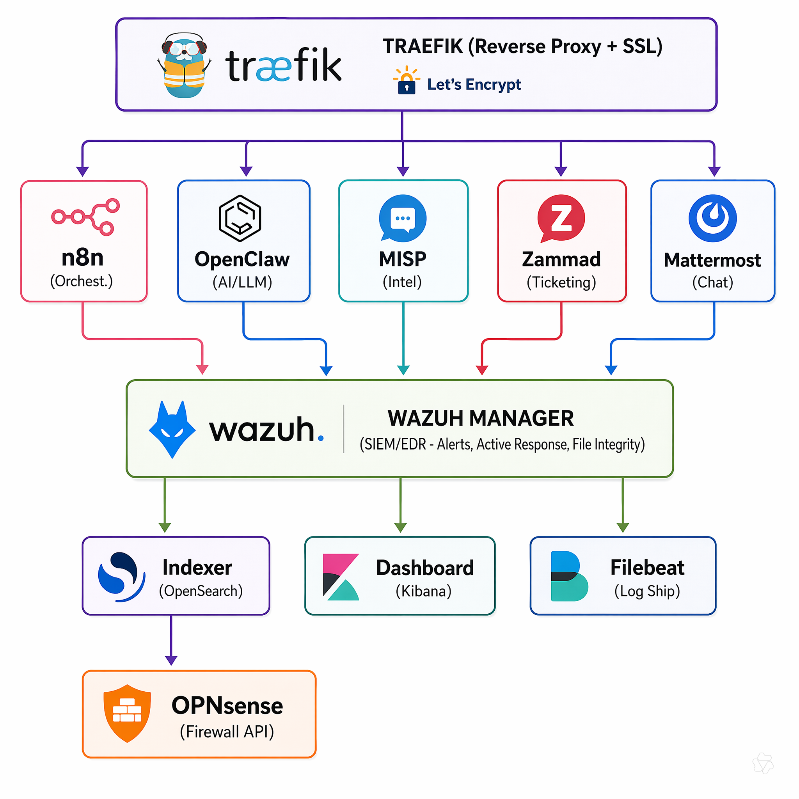
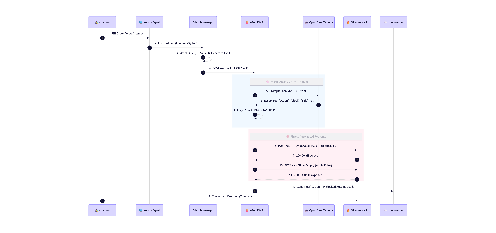

# SOAR Stack - Free/Open Source Security Orchestration

## Architecture

```
┌─────────────────────────────────────────────────────────────────┐
                        TRAEFIK (Reverse Proxy + SSL)
└─────────────────────────────────────────────────────────────────┘
                                    │
        ┌───────────────┬───────────┼───────────┬───────────────┐
        ▼               ▼           ▼           ▼               ▼
   ┌─────────┐     ┌──────────┐ ┌────────┐ ┌──────────┐ ┌───────────┐
   │  n8n    │────▶│ OpenClaw │ │ MISP   │ │ Zammad   │ │ Mattermost│
   │(Orchest.)│     │ (AI/LLM) │ │(Intel) │ │(Ticketing)│ │  (Chat)   │
   └────┬────┘     └──────────┘ └────┬───┘ └────┬─────┘ └─────┬─────┘
        │                             │          │             │
        │          ┌──────────────────┘          │             │
        ▼          ▼                           ▼             ▼
   ┌─────────────────────────────────────────────────────────────┐
   │                    WAZUH MANAGER                            │
   │  (SIEM/EDR - Alerts, Active Response, File Integrity)      │
   └─────────────────────────────────────────────────────────────┘
        │                    │                    │
        ▼                    ▼                    ▼
   ┌─────────┐         ┌──────────┐         ┌──────────┐
   │Indexer  │         │Dashboard │         │ Filebeat │
   │(OpenSearch)        │(Kibana)  │         │(Log Ship)│
   └─────────┘         └──────────┘         └──────────┘
        │
        ▼
   ┌──────────────────┐
   │   OPNsense       │
   │  (Firewall API)  │
   └──────────────────┘
```

```
```

```
## Services & Ports

| Service | Internal Port | External URL | Purpose |
|---------|--------------|--------------|---------|
| Traefik | 80, 443 | https://traefik.yourdomain.com | Reverse proxy, SSL, Dashboard |
| n8n | 5678 | https://n8n.yourdomain.com | Workflow orchestration |
| Ollama | 11434 | https://ollama.yourdomain.com | LLM inference API |
| OpenClaw | 8000 | https://ai.yourdomain.com | AI Agent UI/API |
| Wazuh Dashboard | 5601 | https://wazuh.yourdomain.com | SIEM UI |
| Wazuh Manager | 55000, 1514, 1515 | - | Agent communication |
| MISP | 80 | https://misp.yourdomain.com | Threat intel platform |
| Zammad | 8080 | https://zammad.yourdomain.com | Ticketing system |
| Mattermost | 8065 | https://chat.yourdomain.com | Team communication |

## Quick Start

### 1. Prerequisites
- Linux server (Ubuntu 22.04+ / Debian 12+)
- 8+ vCPU, 32GB+ RAM, 500GB+ SSD
- GPU recommended for Ollama (NVIDIA with cuda)
- Domain name with wildcard DNS (`*.yourdomain.com` → server IP)

### 2. Deploy
```bash
# Clone or copy soar-stack to server
scp -r soar-stack root@your-server:/opt/

# Run deployment
cd /opt/soar-stack
chmod +x deploy.sh
./deploy.sh
```

### 3. Post-Deploy Configuration

**Update `.env` with real values:**
- OPNsense API credentials (System → Access → API in OPNsense)
- SMTP settings for email notifications
- Verify all generated passwords

**Configure Wazuh Agents:**
```bash
# On each endpoint (Linux)
curl -so wazuh-agent.deb https://packages.wazuh.com/4.x/apt/pool/main/w/wazuh-agent/wazuh-agent_4.7.0-1_amd64.deb
dpkg -i wazuh-agent.deb
# Edit /var/ossec/etc/ossec.conf → <server>wazuh.yourdomain.com</server>
systemctl enable --now wazuh-agent
```

**Configure MISP Feeds:**
1. Login to MISP → Sync Actions → List Feeds
2. Enable: CIRCL, AlienVault OTX, MISP Project, Abuse.ch
3. Run initial fetch: "Fetch from all feeds"

**Import n8n Credentials:**
1. Open n8n → Credentials → New Credential
2. Add for each service:
   - **Wazuh API**: HTTP Basic Auth (user: `wazuh`, pass: `$WAZUH_API_PASSWORD`)
   - **MISP**: Header Auth (`Authorization: Bearer <API_KEY>`)
   - **Zammad**: Header Auth (`Authorization: Bearer <TOKEN>`)
   - **Mattermost**: Webhook URL
   - **OPNsense**: Basic Auth (API Key:Secret)
   - **OpenClaw**: No auth (or API key if configured)

**Activate Workflows:**
1. n8n → Workflows → "Wazuh Alert - Triage & Response" → Activate
2. n8n → Workflows → "Daily Threat Intel Sync" → Activate

### 4. Test End-to-End
```bash
# Trigger test alert on Wazuh manager
docker exec soar-wazuh-manager /var/ossec/bin/ossec-control restart
# Or generate test event on agent
logger -t sshd "Failed password for root from 1.2.3.4 port 22 ssh2"

# Verify in n8n: Executions → Check workflow runs
# Verify in Zammad: New ticket created
# Verify in Mattermost: #security-alerts notification
```

## Maintenance

### Backup (daily via cron)
```bash
0 3 * * * /opt/soar-stack/backup.sh >> /var/log/soar-backup.log 2>&1
```

### Updates
```bash
cd /opt/soar-stack
docker compose pull
docker compose up -d --remove-orphans
```

### Logs
```bash
# All services
docker compose -f /opt/soar-stack/traefik/docker-compose.yml logs -f
docker compose -f /opt/soar-stack/n8n/docker-compose.yml logs -f
# etc.

# Wazuh specific
docker exec soar-wazuh-manager tail -f /var/ossec/logs/alerts/alerts.json
```

## Security Hardening

1. **Change all default passwords** in `.env`
2. **Enable 2FA** on all web UIs (n8n, Wazuh, MISP, Zammad, Mattermost)
3. **Restrict Traefik dashboard** to VPN/IP allowlist
4. **Use VPN** for admin access (WireGuard/Tailscale)
5. **Regular updates**: `apt update && apt upgrade -y` weekly
6. **Monitor disk space**: `df -h` alerts at 80%

## Troubleshooting

| Issue | Solution |
|-------|----------|
| n8n workflow fails | Check Executions tab, verify credentials |
| Wazuh agents not connecting | Check port 1514/1515, verify registration password |
| MISP not fetching feeds | Check DNS, proxy, feed URLs in MISP UI |
| Ollama OOM | Reduce `OLLAMA_NUM_PARALLEL`, use smaller model |
| Traefik cert fails | Verify DNS, port 80 open, check Let's Encrypt rate limits |

## File Structure
```
soar-stack/
├── .env                    # All secrets (gitignored)
├── .env.template           # Template for .env
├── deploy.sh               # One-shot deployment
├── backup.sh               # Daily backup script
├── traefik/
│   └── docker-compose.yml
├── ollama/
│   └── docker-compose.yml
├── wazuh/
│   ├── docker-compose.yml
│   ├── config/
│   │   ├── ossec.conf
│   │   ├── local_internal_options.conf
│   │   └── filebeat.yml
│   └── active-response/
│       ├── n8n-webhook
│       ├── firewall-drop
│       └── firewall-unblock
├── misp/
│   └── docker-compose.yml
├── zammad/
│   └── docker-compose.yml
├── mattermost/
│   └── docker-compose.yml
├── n8n/
│   ├── docker-compose.yml
│   ├── workflows/
│   │   ├── wazuh-alert-triage.json
│   │   └── daily-threat-intel-sync.json
│   └── custom-nodes/
└── openclaw/
    └── (uses ollama service)
```

## License
MIT - Free for internal use
